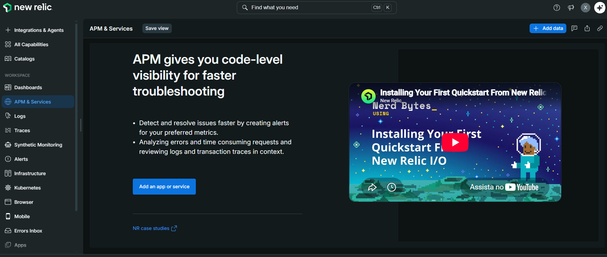
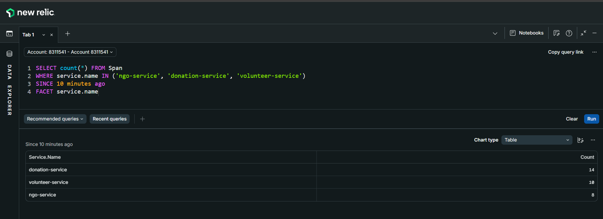
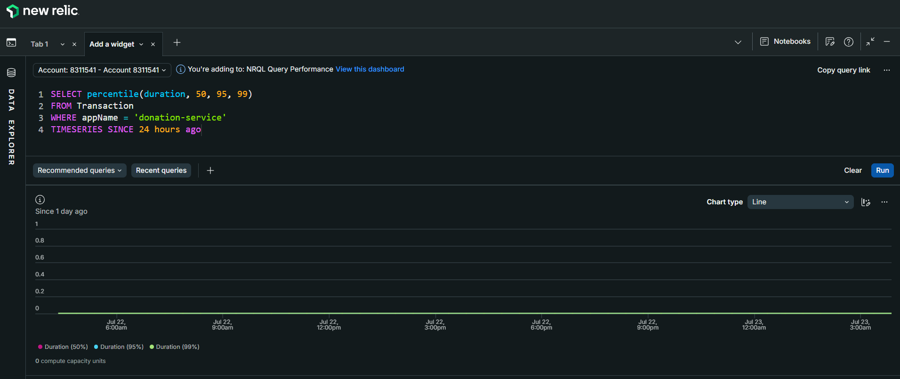
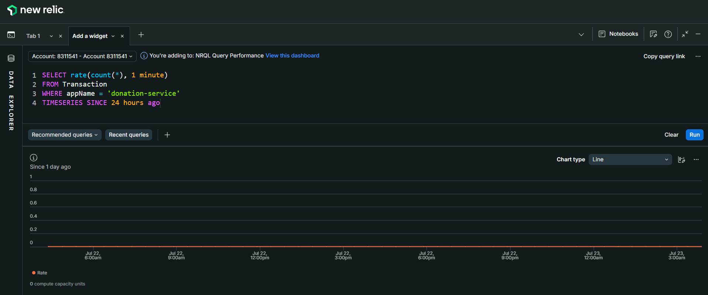
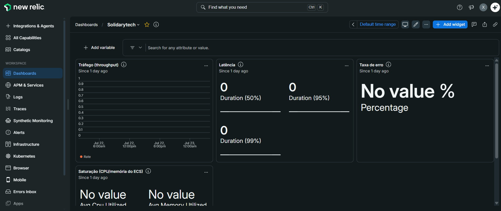

# 1. SRE — Confiabilidade e Golden Metrics

> Documentação de Site Reliability Engineering da plataforma SolidaryTech, cobrindo definição de SLIs, SLOs, SLA, dashboard de observabilidade e estratégia de redução de MTTR.

---

## Arquitetura de Observabilidade

A stack de observabilidade é 100% baseada em **OpenTelemetry** (padrão vendor-neutral), com o **New Relic** como backend de APM via ingestão OTLP nativa. Nenhum código proprietário de vendor foi adicionado às aplicações — se for necessário trocar de plataforma, é só apontar o endpoint OTLP para outro destino.



```
┌────────────────────────────────────────────────────────────┐
│  ECS Fargate                                               │
│  ┌───────────────┐  ┌───────────────────┐  ┌─────────────┐ │
│  │  ngo-service  │  │  donation-service │  │ volunteer   │ │
│  │  Python/Flask │  │  Go (SDK OTel)    │  │ Python/Flask│ │
│  │  OTel auto    │  │  otelhttp + spans │  │ OTel auto   │ │
│  └───────┬───────┘  └─────────┬─────────┘  └──────┬──────┘ │
└──────────┼────────────────────┼───────────────────┼────────┘
           │                    │                   │
           └────────────────────┼───────────────────┘
                                │ OTLP/gRPC :4317
                                ▼
                    ┌───────────────────────┐
                    │  New Relic APM (US)   │
                    │  otlp.nr-data.net     │
                    │  Traces + Metrics     │
                    └───────────────────────┘
```

### Instrumentação por serviço

| Serviço | Linguagem | Tipo de instrumentação | Bibliotecas |
|---|---|---|---|
| `ngo-service` | Python 3.11 | Auto (agente) | `opentelemetry-distro`, `opentelemetry-instrumentation-flask`, `opentelemetry-instrumentation-psycopg2` |
| `donation-service` | Go 1.21 | Manual + SDK | `otel/sdk`, `otelhttp`, spans customizados (`db.insert_donation`) |
| `volunteer-service` | Python 3.11 | Auto (agente) | `opentelemetry-distro`, `opentelemetry-instrumentation-flask` |

> Toda a configuração OTel é injetada via **variáveis de ambiente na task definition do ECS** (`OTEL_EXPORTER_OTLP_ENDPOINT`, `OTEL_EXPORTER_OTLP_HEADERS`, `OTEL_RESOURCE_ATTRIBUTES`, `OTEL_SERVICE_NAME`). 

---

## SLIs e SLOs do `donation-service`

O `donation-service` foi escolhido como componente-alvo dos SLOs por ser o **Hot Path** da plataforma — falhas nele impactam diretamente o recebimento de recursos financeiros por parte das ONGs.

### Definição formal

| SLI | Descrição | Fonte de dados | SLO | Janela |
|---|---|---|---|---|
| **Latência** | Percentual de requisições HTTP com duração menor que 300ms | Atributo `duration` na tabela `Transaction` do New Relic | **≥ 95%** | 28 dias |
| **Taxa de Sucesso** | Percentual de requisições HTTP com status code < 500 (exclui erros do servidor) | Atributo `httpResponseCode` na tabela `Transaction` | **≥ 99,9%** | 28 dias |

### Justificativa dos limiares

- **Latência (< 300ms):** o `donation-service` executa apenas 1 INSERT em PostgreSQL + 1 envio assíncrono para SQS. Requisições que ultrapassam 300ms indicam degradação em algum desses componentes ou saturação de recursos do container. O SLO de 95% aceita variabilidade natural sem tolerar degradação sistêmica.

- **Taxa de Sucesso (99,9%):** o operador SLO conta apenas erros **atribuíveis ao serviço** (5xx), tratando 4xx como problemas de cliente (dados inválidos), coerente com a filosofia do Google SRE Book.

### Queries NRQL de referência

**SLI Latência:**
```sql
SELECT percentage(count(*), WHERE duration < 0.3) AS 'SLI Latência (%)'
FROM Transaction
WHERE appName = 'donation-service' AND name LIKE '%donations%'
SINCE 28 days ago
```






**SLI Taxa de Sucesso:**
```sql
SELECT percentage(count(*), WHERE httpResponseCode < 500) AS 'SLI Sucesso (%)'
FROM Transaction
WHERE appName = 'donation-service' AND name LIKE '%donations%'
SINCE 28 days ago
```

---

## SLA e Error Budget

### SLA declarado

A partir dos SLOs acima, a plataforma SolidaryTech declara aos seus stakeholders (ONGs, doadores e comitê gestor) o seguinte **SLA de disponibilidade do fluxo de doações**:

> **99,9% de disponibilidade mensal**, medida como o percentual de requisições ao endpoint `POST /donations` que retornam status HTTP < 500 e concluem em menos de 300ms, apurada em janela móvel de 28 dias.

### Error Budget

O Error Budget corresponde ao **complemento matemático do SLO** — ou seja, à parcela de falhas que a plataforma pode absorver sem violar o compromisso com os usuários. Para SLO de 99,9%:

| Métrica | Valor |
|---|---|
| Error Budget total (mensal) | **0,1% das requisições** |
| Equivalente em tempo (base 30 dias) | **~43,2 minutos** de indisponibilidade total |
| Consumo aceitável por semana | ~10 minutos |
| Consumo aceitável por dia | ~1,4 minutos |

### Política de uso do Error Budget

- **Budget > 50% restante:** operação normal, deploys sem restrições.
- **Budget entre 20% e 50%:** deploys só com aprovação; foco em correção de bugs conhecidos.
- **Budget < 20%:** **freeze de features** — apenas correções de bugs relacionados a estabilidade.
- **Budget esgotado:** toda a capacidade de engenharia migra para investigação da causa raiz até o SLI voltar ao objetivo.

---

## Dashboard SRE

- Dashboard criado no New Relic com título **`SolidaryTech`**




- **Link do dashboard:** [Abrir Dashboard SRE no New Relic](<LINK_A_PREENCHER>)

- Golden Metrics visíveis (latência, tráfego, erros, saturação)


- Consumo do Error Budget visível em widget dedicado


### Widgets do dashboard (10 painéis)

Organizados em 3 seções conforme a hierarquia de visualização executiva → operacional → forense:

| # | Seção | Widget | Tipo | Métrica |
|---|---|---|---|---|
| 1 | SLO Status | SLO Latência (28d) | Billboard | % de requisições < 300ms |
| 2 | SLO Status | SLO Taxa de Sucesso (28d) | Billboard | % de requisições sem 5xx |
| 3 | SLO Status | Error Budget Restante | Billboard | % do budget mensal disponível |
| 4 | Golden Metrics | Latência p50/p95/p99 | Line | Percentis por serviço |
| 5 | Golden Metrics | Tráfego | Area | Requisições/min por serviço |
| 6 | Golden Metrics | Taxa de Erro 5xx | Line | % de erros por serviço |
| 7 | Golden Metrics | Saturação CPU | Line | `aws.ecs.CPUUtilization` |
| 8 | Forense | Erros recentes | Table | Últimos 20 `TransactionError` |
| 9 | Forense | Top endpoints por latência | Bar | Endpoints mais lentos |
| 10 | Forense | Apdex | Gauge | Índice de satisfação do usuário |

### Evidência visual

**Print do Dashboard SRE:**  


**Print do SLO Status (topo):**


**Print das Golden Metrics em tempo real:**


---

## Rastreabilidade Distribuída (Distributed Tracing)

Cada requisição HTTP gera um **trace distribuído** com múltiplos spans que atravessam o serviço. No `donation-service`, a instrumentação manual em Go produz uma hierarquia clara:

```
POST /donations                              (span raiz — otelhttp)
  └── db.insert_donation                     (span filho — tracer manual)
       ├── attribute: donation.ngo_id = 1
       └── attribute: donation.amount = 250.00
```

Essa granularidade permite responder rapidamente perguntas como:
- *"O tempo total foi 800ms — quanto foi banco e quanto foi HTTP overhead?"*
- *"Quais valores de doação demoraram mais que 500ms nas últimas 24h?"*

**Query de validação:**
```sql
SELECT count(*), average(duration.ms) AS 'Latência média DB (ms)'
FROM Span
WHERE service.name = 'donation-service' AND name = 'db.insert_donation'
SINCE 1 hour ago
```

**Print da árvore de spans:**


---

## MTTR — Mean Time To Recovery

A instrumentação OTel dos 3 serviços permite que qualquer erro apareça no APM em segundos (via trace), em vez de depender de logs manuais — isso reduz o tempo de detecção de incidentes de minutos/horas (checagem manual) para near real-time, o que impacta diretamente o MTTR ao eliminar a etapa de "descobrir que algo está errado" do ciclo de resposta.

A meta é reduzir o **MTTR estimado da plataforma para < 20 minutos** através da automação em três frentes:

### Fórmula do MTTR

```
MTTR = Tempo de Detecção + Tempo de Diagnóstico + Tempo de Recuperação
```

### Redução por etapa

| Etapa | Sem observabilidade | Com stack atual | Ganho |
|---|---|---|---|
| **Detecção** | Reclamação do usuário / verificação manual (30 min – 4h) | Alerta NRQL disparado em ≤ 5 min | **~90%** |
| **Diagnóstico** | Ler logs no CloudWatch, correlacionar manualmente (30 min – 2h) | Trace distribuído no APM aponta o span com falha em ≤ 10 min | **~85%** |
| **Recuperação** | Rebuild + redeploy manual (10 – 20 min) | Rollback automático via `deployment_circuit_breaker` do ECS em ≤ 3 min | **~80%** |
| **MTTR total estimado** | 1h10min – 6h20min | **< 20 min** | **~90%** |

### Detecção automática — alertas configurados

- [x] **New Relic Alerts Policy:** `SolidaryTech — SRE Alerts`
- [x] **3 condições NRQL** configuradas com notificação por e-mail:

| # | Alerta | Condição | Severidade |
|---|---|---|---|
| 1 | SLO de latência violado | `% req < 300ms` cair abaixo de 95 por 5 min | Crítica |
| 2 | Burn rate do Error Budget alto | `% req com 5xx` acima de 0,1 por 5 min | Crítica |
| 3 | Ausência de sinal | Sem dados de qualquer serviço por 5 min | Warning |

**Print da policy de alertas:**


### Runbook de resposta a incidentes

Em caso de disparo de alerta, o fluxo é:

```
Alerta disparado → Notificação por e-mail
  │
  ▼
Abrir Dashboard SRE → confirmar SLO violado
  │
  ▼
Abrir trace do span com falha no APM → identificar componente
  │
  ▼
Decisão:
  ├── Bug de código → rollback via ArgoCD/ECS force-new-deployment
  ├── Recurso saturado → scale up temporário via HPA/desired_count
  └── Dependência externa (RDS/SQS) → escalar time responsável
  │
  ▼
Post-mortem obrigatório se Error Budget consumido > 5% em 24h
```

### Circuit Breaker do ECS

Configuração aplicada em `infra/terraform/modules/ecs/main.tf`:

```hcl
resource "aws_ecs_service" "services" {
  # ...
  deployment_circuit_breaker {
    enable   = true
    rollback = true
  }
}
```

**Efeito:** se um novo deploy falhar em subir tasks saudáveis dentro do período de estabilização, o ECS **automaticamente reverte para a task definition anterior**, sem intervenção humana. Isso limita o impacto de um deploy ruim ao intervalo entre o push e a detecção da falha — tipicamente menos de 5 minutos.

---

## Evidências de Operação

- [x] 3 serviços instrumentados e enviando telemetria
- [x] Traces com spans customizados no `donation-service` (evidência de instrumentação manual em Go)
- [x] Dashboard SRE publicado
- [x] Error Budget calculado em tempo real via query NRQL
- [x] Circuit Breaker do ECS ativo em produção (`lab`)
- [x] Alertas configurados e testados

Documentação detalhada, disponível em aqui: [New Relic - Passo a passo](./sre/new-relic.md).

### Referências

- [Google SRE Book — Cap. 4: Service Level Objectives](https://sre.google/sre-book/service-level-objectives/)
- [OpenTelemetry Specification](https://opentelemetry.io/docs/specs/otel/)
- [New Relic OTLP Endpoint Docs](https://docs.newrelic.com/docs/opentelemetry/best-practices/opentelemetry-otlp/)
