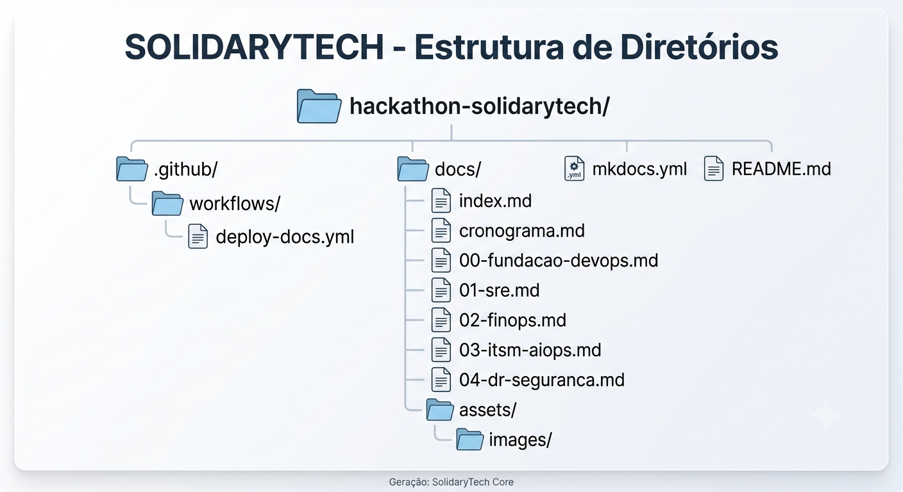

# SolidaryTech — Documentação (Hackathon Fase 5)

Documentação técnica do projeto, construída com **MkDocs** (gratuito e open-source) e publicada automaticamente no **GitHub Pages** via GitHub Actions.

## Estrutura do projeto

