# Estratégia de Provisionamento — Lab AWS

> Guia completo para subir o ambiente lab do zero, validar cada camada
> e estar pronto para commitar no GitHub com evidências reais.

---

## Visão Geral

O provisionamento é dividido em **4 Steps sequenciais** que respeitam
as dependências entre módulos. Cada step termina com uma validação
antes de avançar.

```
STEP 1 ──────────────────────────── Sem dependências externas
  ├── networking  (VPC, subnets, SGs, NAT)
  └── ecr         (repositórios de imagem)

STEP 2 ──────────────────────────── Independente de networking
  ├── sqs         (filas + DLQ)
  └── dynamodb    (tabelas NoSQL)

STEP 3 ──────────────────────────── Depende de networking
  └── rds         (PostgreSQL — leva ~8 min)

STEP 4 ──────────────────────────── Depende de tudo acima
  └── ecs         (Fargate Spot — tasks dos 3 serviços)
```

**Tempo total estimado:** ~20–25 minutos (RDS é o gargalo)

---

## Pré-requisitos

### 1. Ferramentas locais

```bash
# Verificar versões
terraform version    # precisa >= 1.6
aws --version        # precisa >= 2.0

# Se não tiver o tfenv:
brew install tfenv   # macOS
tfenv install 1.8.0
tfenv use 1.8.0
```

### 2. Credenciais AWS

```bash
# Opção A — perfil nomeado (recomendado)
aws configure --profile solidarytech-lab
export AWS_PROFILE=solidarytech-lab

# Opção B — variáveis de ambiente
export AWS_ACCESS_KEY_ID="AKIA..."
export AWS_SECRET_ACCESS_KEY="..."
export AWS_DEFAULT_REGION="us-east-1"

# Confirmar identidade
aws sts get-caller-identity
# Esperado: { "Account": "123456789012", "UserId": "...", "Arn": "arn:aws:iam::..." }
```

### 3. Senha do banco

```bash
# Definir e NUNCA commitar
export TF_VAR_db_password="SolidaryLab2024!"
# Mínimo 12 caracteres — validação está no variables.tf
```

---

## STEP 0 — Validação Estática (sem tocar na AWS)

Execute antes de qualquer `apply`. Detecta ~80% dos erros de graça.

```bash
cd terraform/environments/lab

# 0.1 — Formato
terraform fmt -check -recursive ../../ \
  && echo "✅ fmt ok" \
  || (echo "❌ Execute: terraform fmt -recursive ../../" && exit 1)
```

```bash
# 0.2 — Validar cada módulo individualmente
for mod in ../../modules/*/; do
  name=$(basename $mod)
  cd $mod
  terraform init -backend=false -input=false -no-color > /dev/null 2>&1
  result=$(terraform validate -no-color 2>&1)
  if echo "$result" | grep -q "Success"; then
    echo "✅ $name"
  else
    echo "❌ $name FALHOU:"
    echo "$result"
  fi
  cd - > /dev/null
done
```

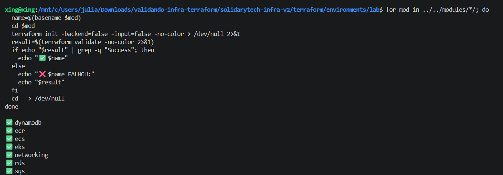

```bash
# 0.3 — Init do ambiente lab (backend local por enquanto)
terraform init -backend=false
```
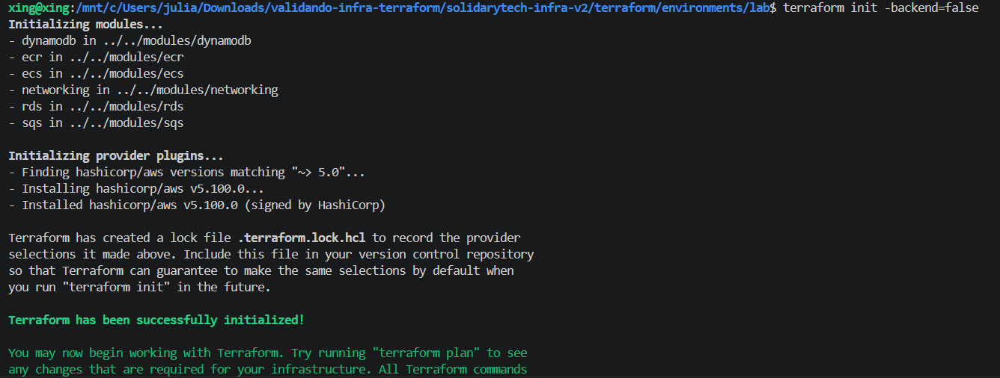

```bash
# 0.4 — Validate do ambiente completo
terraform validate && echo "✅ lab válido"
```

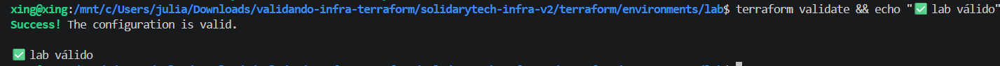

**✅ Critério para avançar:** todos os módulos validados sem erro.

---

## STEP 1 — Networking + ECR

São independentes entre si e não têm dependências externas.
Podem ser aplicados em paralelo, mas por clareza faremos em sequência.

```bash
cd terraform/environments/lab

# 1.1 — Plan somente networking

# Definir versão do tfenv:
tfenv use 1.5.7

# Plan:
terraform plan \
  -target=module.networking \
  -var="db_password=${TF_VAR_db_password}" \
  -out=step1a.tfplan \
  -no-color | tee /tmp/step1a-plan.txt
```
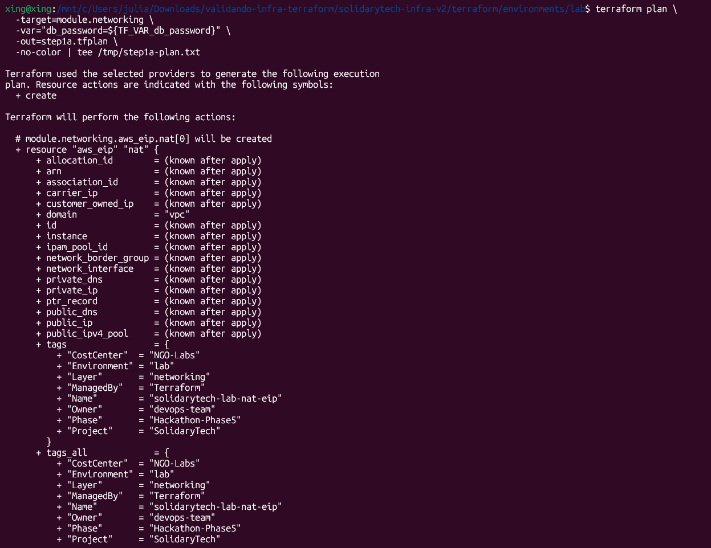
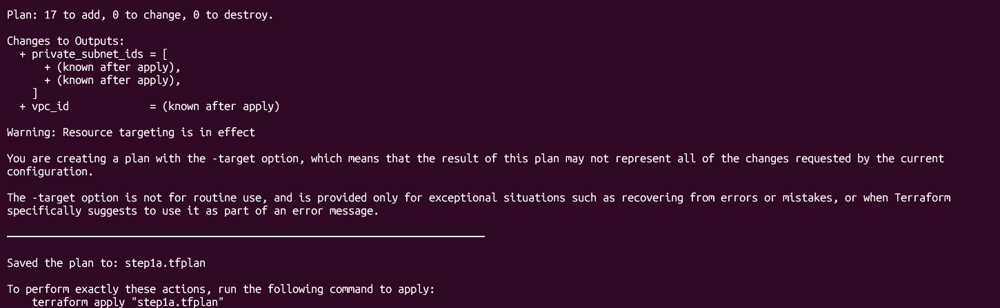

```bash
# Checar o que será criado (esperado: ~12 recursos)
grep "^  #\|will be created\|will be destroyed" /tmp/step1a-plan.txt
```
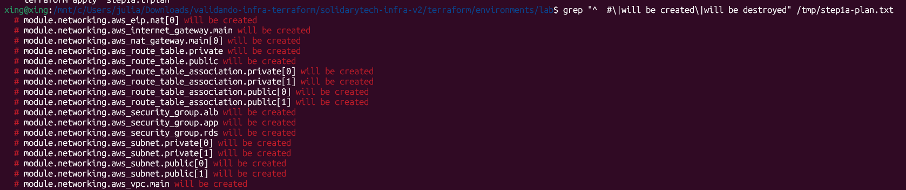
```bash
# 1.2 — Apply networking
terraform apply step1a.tfplan
```
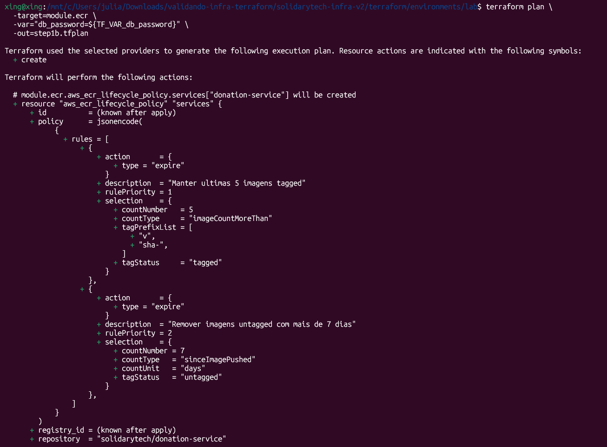
### ✅ Validar Networking

```bash
# VPC criada com tags corretas
aws ec2 describe-vpcs \
  --filters "Name=tag:Project,Values=SolidaryTech" \
  --query 'Vpcs[*].{ID:VpcId,CIDR:CidrBlock,State:State}' \
  --output table

# 4 subnets (2 públicas + 2 privadas)
aws ec2 describe-subnets \
  --filters "Name=tag:Project,Values=SolidaryTech" \
  --query 'Subnets[*].{ID:SubnetId,AZ:AvailabilityZone,CIDR:CidrBlock,Public:MapPublicIpOnLaunch}' \
  --output table

# NAT Gateway ativo
aws ec2 describe-nat-gateways \
  --filter "Name=tag:Project,Values=SolidaryTech" \
  --query 'NatGateways[*].{ID:NatGatewayId,State:State,SubnetId:SubnetId}' \
  --output table

# 3 Security Groups
aws ec2 describe-security-groups \
  --filters "Name=tag:Project,Values=SolidaryTech" \
  --query 'SecurityGroups[*].{ID:GroupId,Name:GroupName}' \
  --output table
```
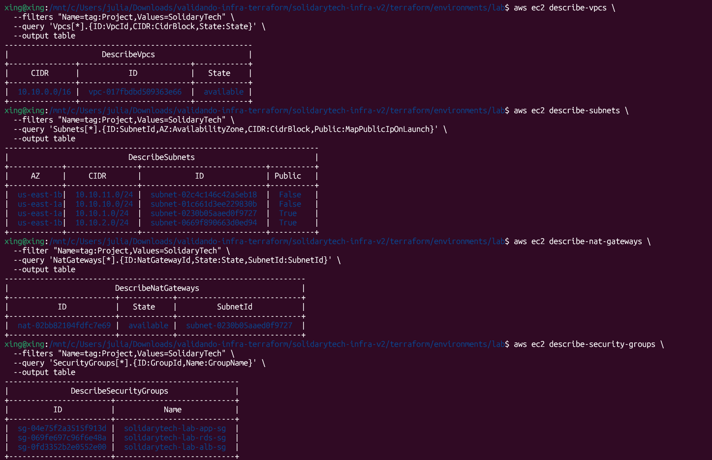
```bash
# 1.3 — Plan + Apply ECR
terraform plan \
  -target=module.ecr \
  -var="db_password=${TF_VAR_db_password}" \
  -out=step1b.tfplan
```

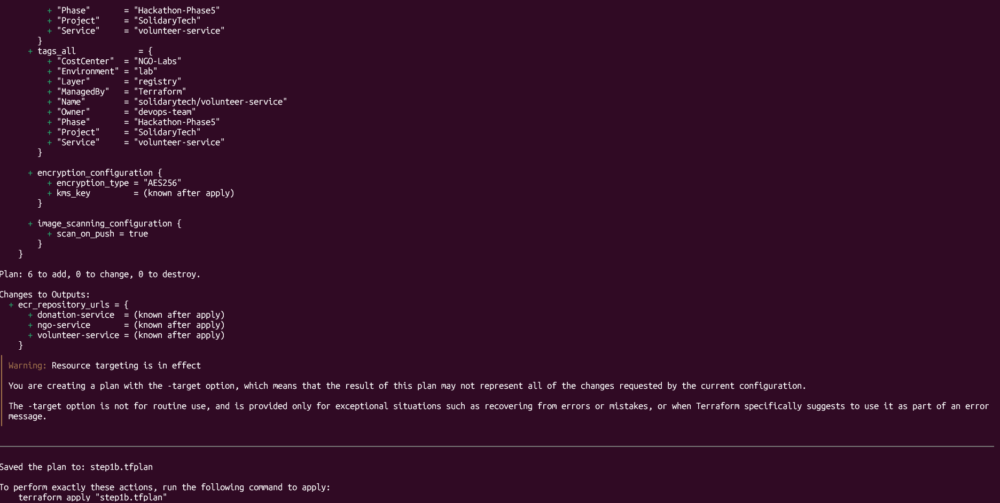

```bash
terraform apply step1b.tfplan
```
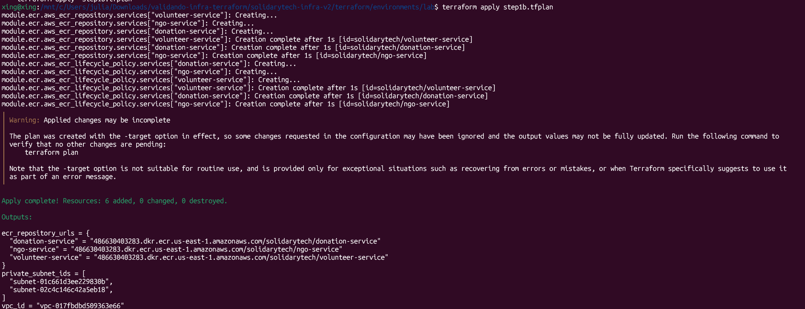

### ✅ Validar ECR

```bash
# 3 repositórios criados
aws ecr describe-repositories \
  --query 'repositories[*].{Name:repositoryName,URI:repositoryUri,ScanOnPush:imageScanningConfiguration.scanOnPush}' \
  --output table

# Testar push de imagem (teste real de acesso)
AWS_ACCOUNT=$(aws sts get-caller-identity --query Account --output text)
REGION="us-east-1"
REGISTRY="${AWS_ACCOUNT}.dkr.ecr.${REGION}.amazonaws.com"

aws ecr get-login-password --region $REGION \
  | docker login --username AWS --password-stdin $REGISTRY \
  && echo "✅ Login ECR ok"
```
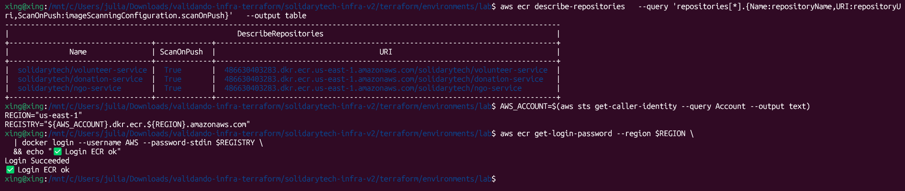
---

## STEP 2 — SQS + DynamoDB

Independentes de networking. Rápidos (~1–2 min cada).

```bash
# 2.1 — Plan + Apply SQS e DynamoDB juntos
terraform plan \
  -target=module.sqs \
  -target=module.dynamodb \
  -var="db_password=${TF_VAR_db_password}" \
  -out=step2.tfplan
```
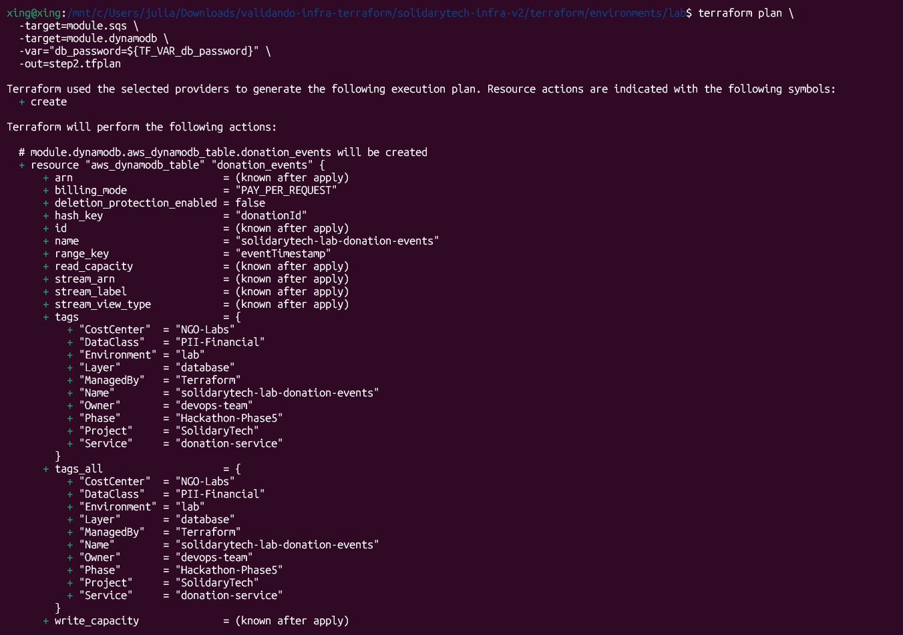
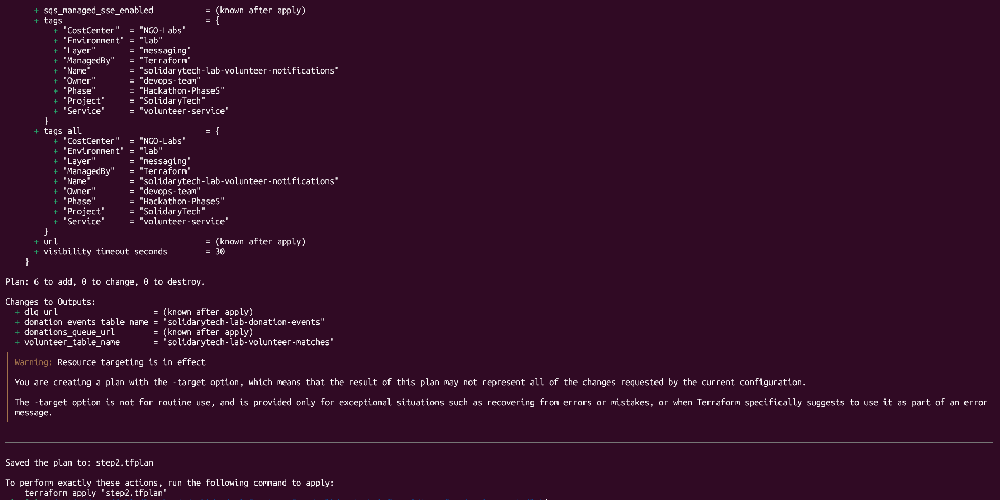

```bash
terraform apply step2.tfplan
```
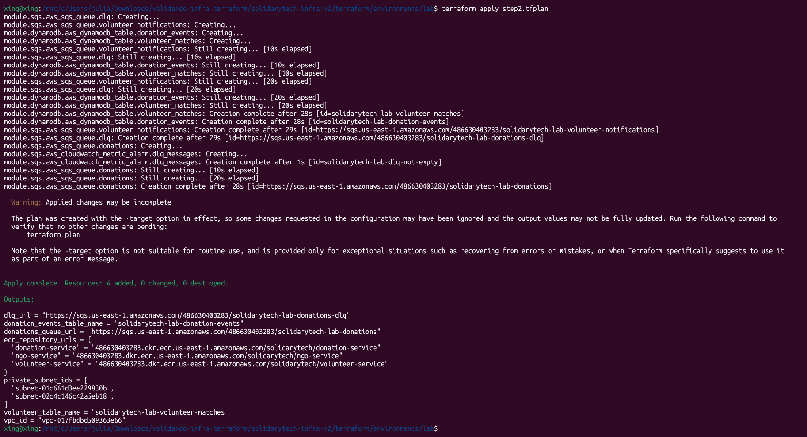

### ✅ Validar SQS

```bash
# 3 filas criadas (donations, dlq, volunteer-notifications)
aws sqs list-queues \
  --queue-name-prefix solidarytech \
  --query 'QueueUrls' \
  --output table

# Confirmar DLQ vinculada à fila principal
DONATIONS_URL=$(aws sqs get-queue-url \
  --queue-name solidarytech-lab-donations \
  --query QueueUrl --output text)

aws sqs get-queue-attributes \
  --queue-url $DONATIONS_URL \
  --attribute-names RedrivePolicy VisibilityTimeout \
  --output json

# Teste funcional: enviar e receber mensagem
aws sqs send-message \
  --queue-url $DONATIONS_URL \
  --message-body '{"test": "donation-event", "amount": 50.00}' \
  --query 'MessageId' --output text

aws sqs receive-message \
  --queue-url $DONATIONS_URL \
  --query 'Messages[0].Body' --output text
```
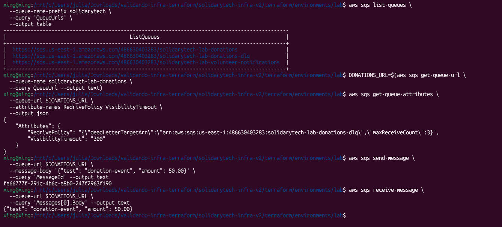

### ✅ Validar DynamoDB

```bash
# 2 tabelas criadas
aws dynamodb list-tables \
  --query 'TableNames[?contains(@, `solidarytech`)]' \
  --output table

# Confirmar PITR habilitado nas duas tabelas
for table in solidarytech-lab-volunteer-matches solidarytech-lab-donation-events; do
  status=$(aws dynamodb describe-continuous-backups \
    --table-name $table \
    --query 'ContinuousBackupsDescription.PointInTimeRecoveryDescription.PointInTimeRecoveryStatus' \
    --output text)
  echo "$table: PITR=$status"
done

# Teste funcional: inserir e ler item
aws dynamodb put-item \
  --table-name solidarytech-lab-donation-events \
  --item '{"donationId":{"S":"test-001"},"eventTimestamp":{"S":"2024-01-01T00:00:00Z"},"ngoId":{"S":"ngo-test"}}' \
  && echo "✅ DynamoDB write ok"

aws dynamodb get-item \
  --table-name solidarytech-lab-donation-events \
  --key '{"donationId":{"S":"test-001"},"eventTimestamp":{"S":"2024-01-01T00:00:00Z"}}' \
  --query 'Item' --output json
```

---

## STEP 3 — RDS PostgreSQL

**Atenção:** este step leva ~8 minutos. O comando `wait` bloqueia até o banco estar disponível.

```bash
# 3.1 — Plan RDS
terraform plan \
  -target=module.rds \
  -var="db_password=${TF_VAR_db_password}" \
  -out=step3.tfplan \
  -no-color | tee /tmp/step3-plan.txt
```
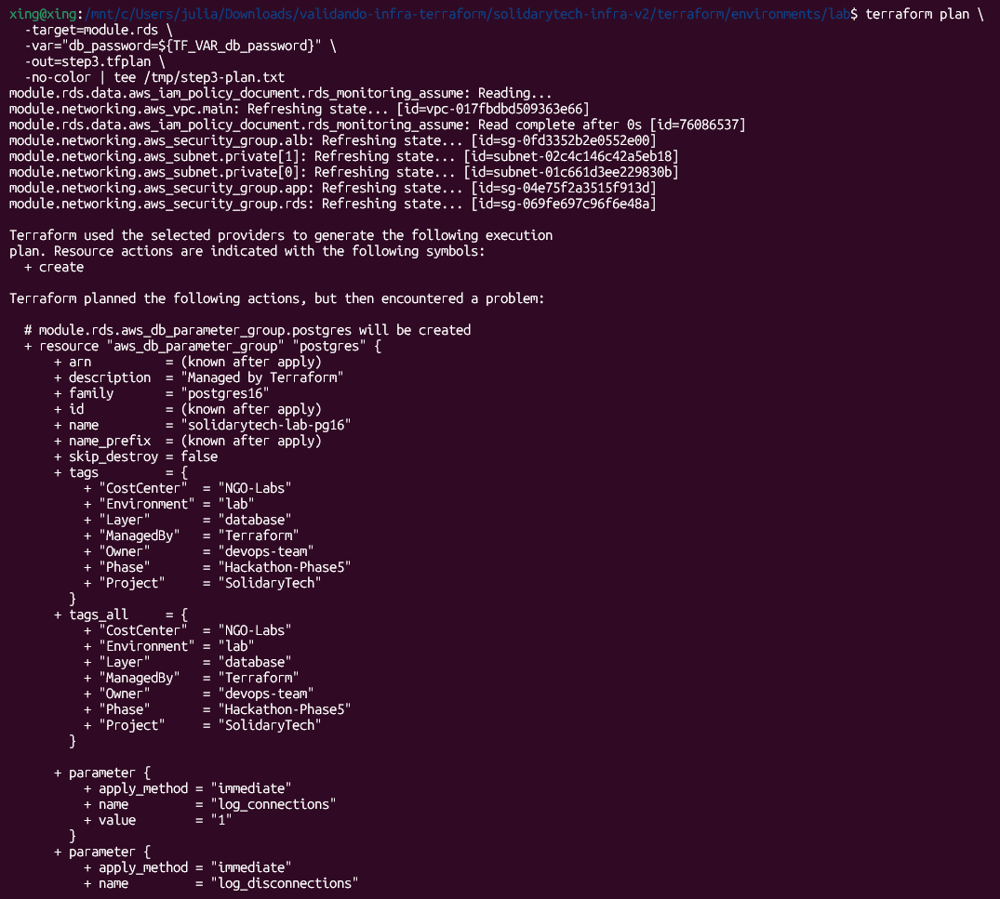
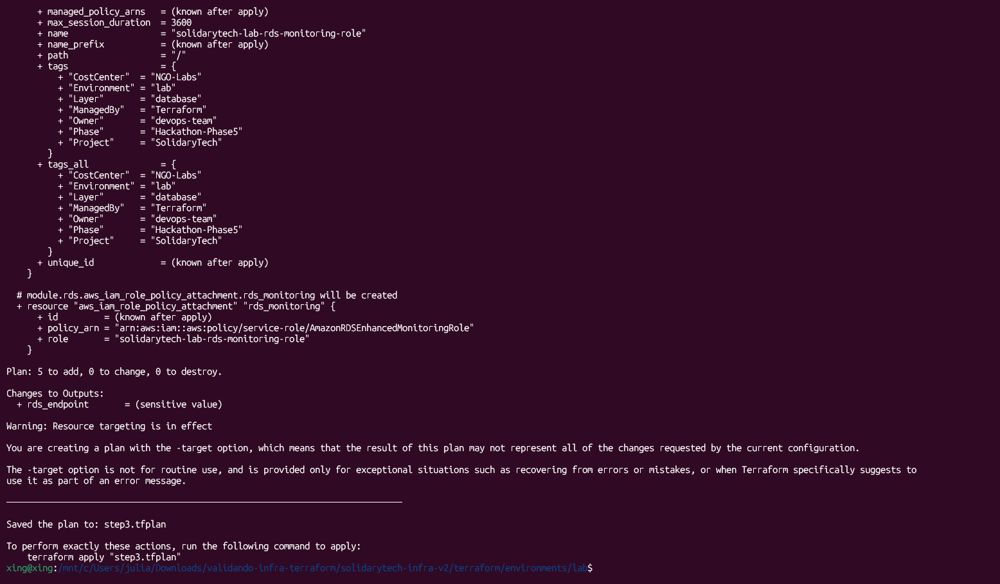

```bash
# Checar o que será criado (esperado: ~4 recursos)
grep "will be created" /tmp/step3-plan.txt
```
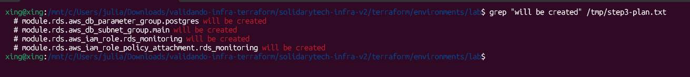

```bash
# 3.2 — Apply RDS (aguardar ~8 min)
terraform apply step3.tfplan
```
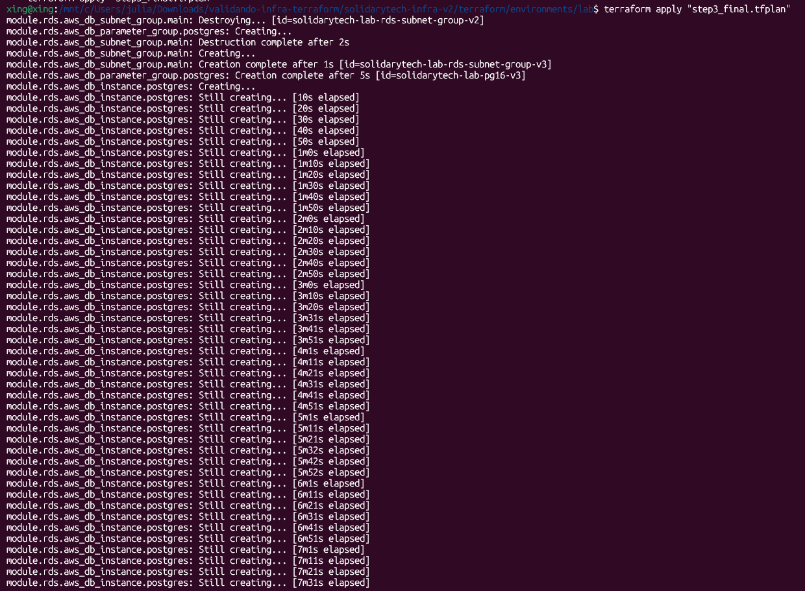
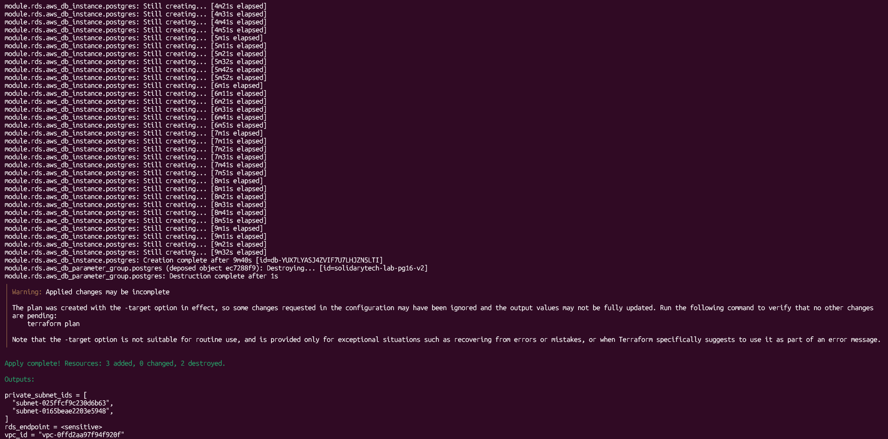

### ✅ Validar RDS

```bash
# Aguardar banco ficar available
echo "Aguardando RDS... (pode levar até 8 min)"
aws rds wait db-instance-available \
  --db-instance-identifier solidarytech-lab-postgres \
  && echo "✅ RDS available"
```

```bash
# Checar configurações
aws rds describe-db-instances \
  --db-instance-identifier solidarytech-lab-postgres \
  --query 'DBInstances[0].{
    Status:DBInstanceStatus,
    Endpoint:Endpoint.Address,
    Port:Endpoint.Port,
    Class:DBInstanceClass,
    MultiAZ:MultiAZ,
    Encrypted:StorageEncrypted,
    BackupRetention:BackupRetentionPeriod,
    PerformanceInsights:PerformanceInsightsEnabled
  }' \
  --output json

# Pegar endpoint para teste de conexão
RDS_HOST=$(terraform output -raw rds_endpoint)
echo "RDS Host: $RDS_HOST"

# Teste de conectividade (via bastion ou task ECS temporária)
# Alternativa: verificar que o SG bloqueia acesso público
aws ec2 describe-security-group-rules \
  --filters "Name=group-id,Values=$(aws ec2 describe-security-groups \
    --filters 'Name=tag:Name,Values=solidarytech-lab-rds-sg' \
    --query 'SecurityGroups[0].GroupId' --output text)" \
  --query 'SecurityGroupRules[?IsEgress==`false`].{Port:FromPort,Source:CidrIpv4,SourceSG:ReferencedGroupInfo.GroupId}' \
  --output table
```
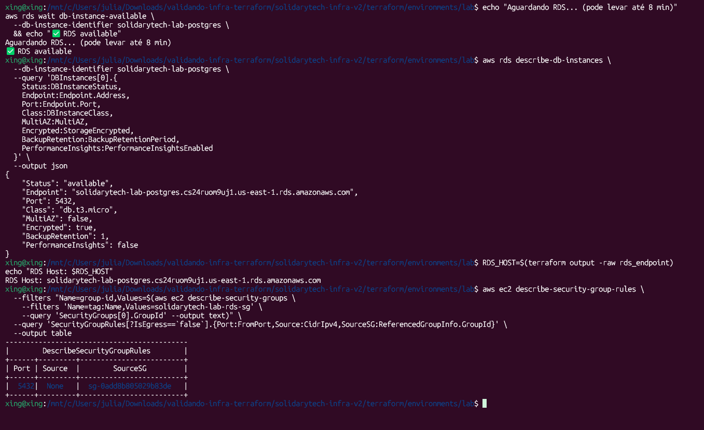

---

## STEP 4 — ECS Fargate Spot

Depende de networking (subnets, SG), ECR (registry URL), RDS e SQS.

```bash
# 4.1 — Plan ECS
terraform plan \
  -var="db_password=${TF_VAR_db_password}" \
  -target=module.ecs \
  -out=step4.tfplan \
  -no-color | tee /tmp/step4-plan.txt
```
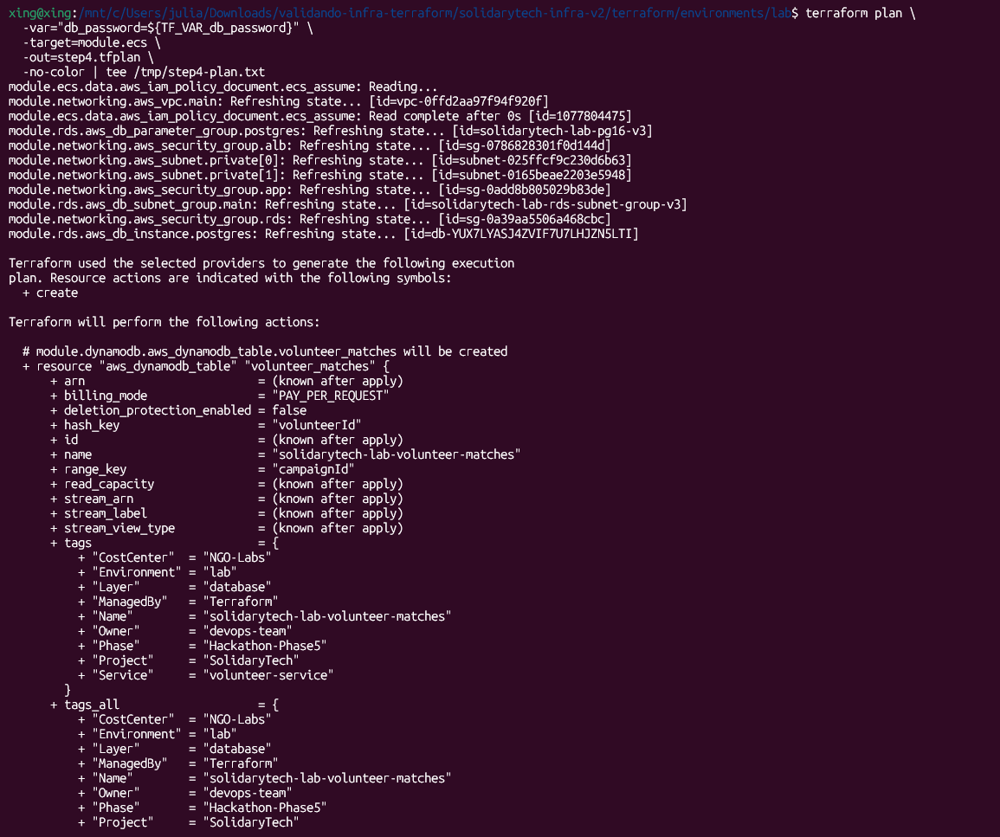
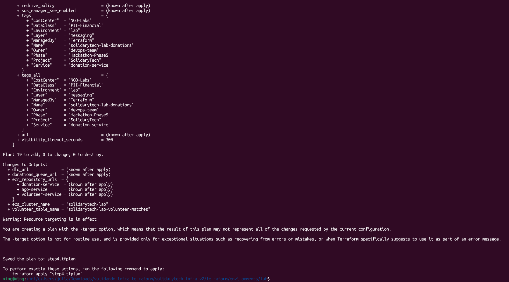

```bash
# 4.2 — Apply ECS
terraform apply step4.tfplan
```
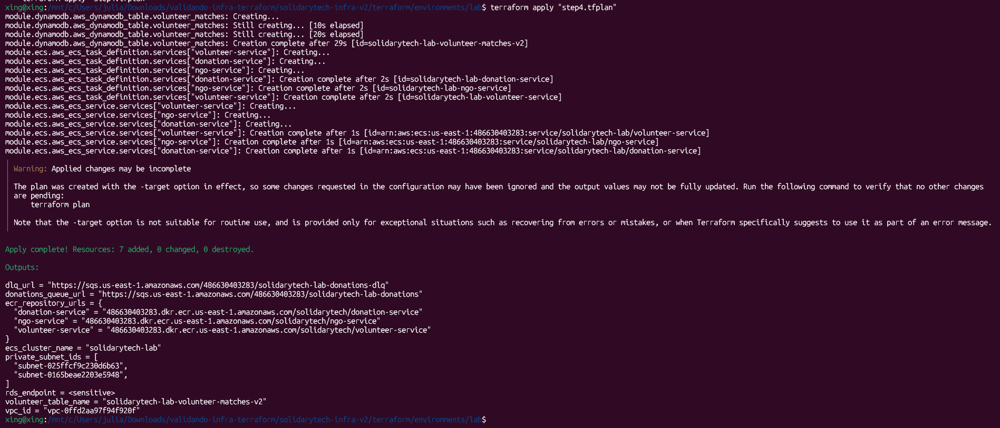
### ✅ Validar ECS

```bash
CLUSTER="solidarytech-lab"

# Cluster criado
aws ecs describe-clusters \
  --clusters $CLUSTER \
  --query 'clusters[0].{Name:clusterName,Status:status,ActiveServices:activeServicesCount}' \
  --output json

# 3 services criados
aws ecs list-services --cluster $CLUSTER --output table

# Status dos services (desired vs running)
aws ecs describe-services \
  --cluster $CLUSTER \
  --services ngo-service donation-service volunteer-service \
  --query 'services[*].{
    Name:serviceName,
    Status:status,
    Desired:desiredCount,
    Running:runningCount,
    Pending:pendingCount
  }' \
  --output table
```
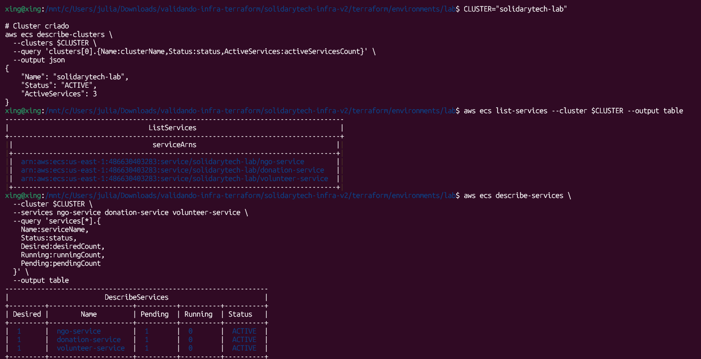

```bash
# Logs das tasks (se algo falhar, aqui está o erro)
LOG_GROUP="/ecs/solidarytech/lab/donation-service"
aws logs get-log-events \
  --log-group-name $LOG_GROUP \
  --log-stream-name $(aws logs describe-log-streams \
    --log-group-name $LOG_GROUP \
    --order-by LastEventTime \
    --descending \
    --query 'logStreams[0].logStreamName' --output text) \
  --limit 50 \
  --query 'events[*].message' \
  --output text
```
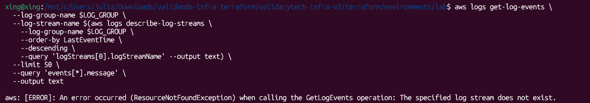
---

## STEP 5 — Validação Final (todo ambiente)

```bash
cd terraform/environments/lab

# 5.1 — Apply completo sem -target (garante que não ficou nada pendente)
terraform plan \
  -var="db_password=${TF_VAR_db_password}" \
  -detailed-exitcode -no-color 2>&1 | tee /tmp/final-plan.txt

EXIT_CODE=$?
if [ $EXIT_CODE -eq 0 ]; then
  echo "✅ Nenhuma mudança pendente — infra 100% aplicada"
elif [ $EXIT_CODE -eq 2 ]; then
  echo "⚠️  Ainda há mudanças pendentes — aplique o plan acima"
else
  echo "❌ Erro no plan"
fi
```
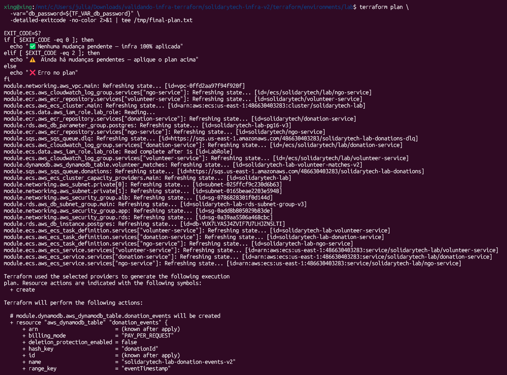
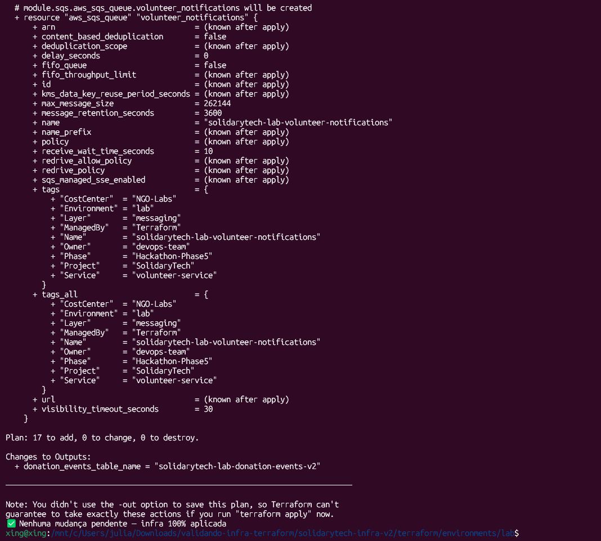

```bash
# 5.2 — Verificar tags em todos os recursos (FinOps)
TAGGED=$(aws resourcegroupstaggingapi get-resources \
  --tag-filters Key=Project,Values=SolidaryTech \
  --query 'length(ResourceTagMappingList)')
echo "Recursos tagueados com Project=SolidaryTech: $TAGGED"

# 5.3 — Outputs finais
terraform output -json | jq '{
  vpc: .vpc_id.value,
  ecs_cluster: .ecs_cluster_name.value,
  ecr_repos: .ecr_repository_urls.value,
  donations_queue: .donations_queue_url.value,
  volunteer_table: .volunteer_table_name.value
}'

# 5.4 — State summary
echo ""
echo "=== Recursos no Terraform State ==="
terraform state list | sort | awk -F. '{print $1"."$2}' | sort -u
echo "Total: $(terraform state list | wc -l) recursos"
```

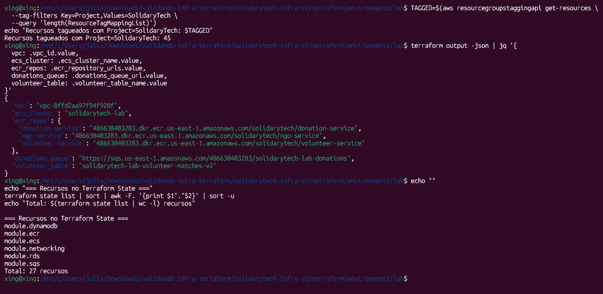
---

## STEP 6 — Migrar para Backend S3 (antes do GitHub)

Depois de validar tudo localmente, migre o state para S3.
Isso permite que o GitHub Actions acesse o mesmo state.

```bash
# 6.1 — Criar bucket de state
aws s3 mb s3://solidarytech-tfstate --region us-east-1

aws s3api put-bucket-versioning \
  --bucket solidarytech-tfstate \
  --versioning-configuration Status=Enabled

aws s3api put-bucket-encryption \
  --bucket solidarytech-tfstate \
  --server-side-encryption-configuration \
  '{"Rules":[{"ApplyServerSideEncryptionByDefault":{"SSEAlgorithm":"AES256"}}]}'

aws s3api put-public-access-block \
  --bucket solidarytech-tfstate \
  --public-access-block-configuration \
  "BlockPublicAcls=true,IgnorePublicAcls=true,BlockPublicPolicy=true,RestrictPublicBuckets=true"

echo "✅ Bucket criado e configurado"

# 6.2 — Descomentar o backend no main.tf
# (editar terraform/environments/lab/main.tf — remover o comentário do backend "s3")

# 6.3 — Migrar state local para S3
terraform init -migrate-state
# Responda "yes" quando perguntado

# 6.4 — Confirmar migração
aws s3 ls s3://solidarytech-tfstate/lab/ && echo "✅ State migrado para S3"
```

---

## Comandos de Troubleshooting

```bash
# Ver log detalhado do Terraform
export TF_LOG=ERROR   # ERROR | WARN | INFO | DEBUG | TRACE
terraform plan -var="db_password=${TF_VAR_db_password}" 2>&1 | grep -E "Error|error"
export TF_LOG=

# Inspecionar recurso específico no state
terraform state show module.networking.aws_vpc.main
terraform state show module.rds.aws_db_instance.postgres

# Forçar refresh do state (detectar mudanças manuais)
terraform refresh -var="db_password=${TF_VAR_db_password}"

# Remover recurso do state SEM destruir (use com cautela)
# terraform state rm module.ecs.aws_ecs_service.services[\"ngo-service\"]

# Destruir ambiente completo (cleanup de custos)
terraform destroy -var="db_password=${TF_V}"AR_db_password
```
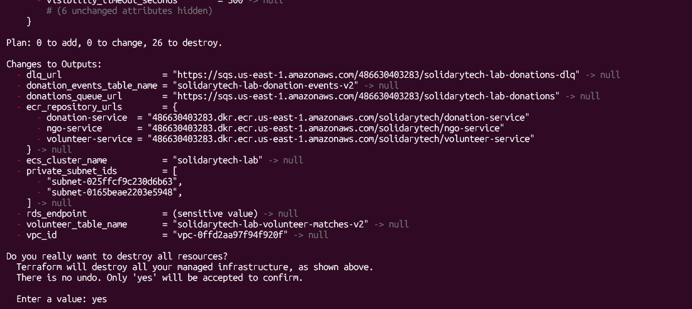
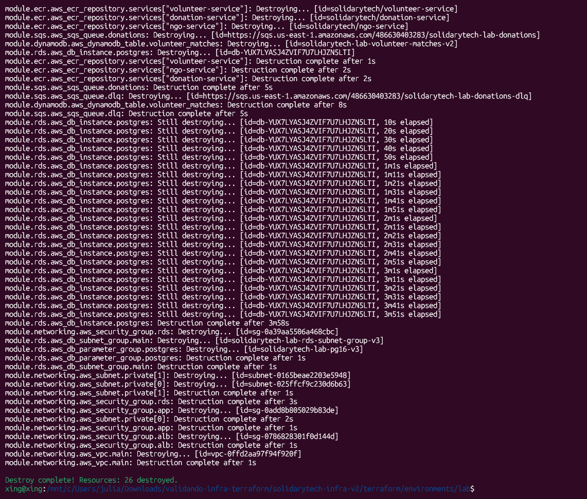
---

## Estimativa de Custo Lab

| Recurso | Especificação | Custo/hora | Custo/mês |
|---------|--------------|-----------|----------|
| NAT Gateway | 1x us-east-1 | ~$0.045 | ~$32 |
| RDS PostgreSQL | db.t3.micro Single-AZ | ~$0.017 | ~$12 |
| ECS Fargate Spot | 3 tasks × 0.25 vCPU | ~$0.003 | ~$2 |
| DynamoDB | On-demand (idle) | $0 | ~$0 |
| SQS | < 1M msgs | $0 | ~$0 |
| ECR | < 0.5GB | ~$0.001 | ~$0.50 |
| **Total** | | | **~$47/mês** |

> 💡 **Dica FinOps:** desligue o NAT Gateway fora do horário de trabalho.
> Ele sozinho custa ~$32/mês. Um script simples economiza ~$20/mês em lab.

```bash
# Destruir apenas NAT GW quando não usar (mantém o resto da infra)
terraform destroy \
  -target=module.networking.aws_nat_gateway.main \
  -target=module.networking.aws_eip.nat \
  -var="db_password=${TF_VAR_db_password}" \
  -auto-approve

# Recriar quando precisar
terraform apply \
  -target=module.networking.aws_nat_gateway.main \
  -target=module.networking.aws_eip.nat \
  -var="db_password=${TF_VAR_db_password}" \
  -auto-approve
```
